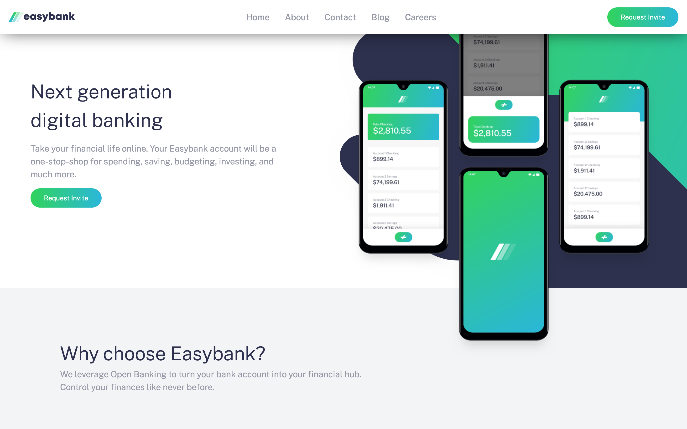
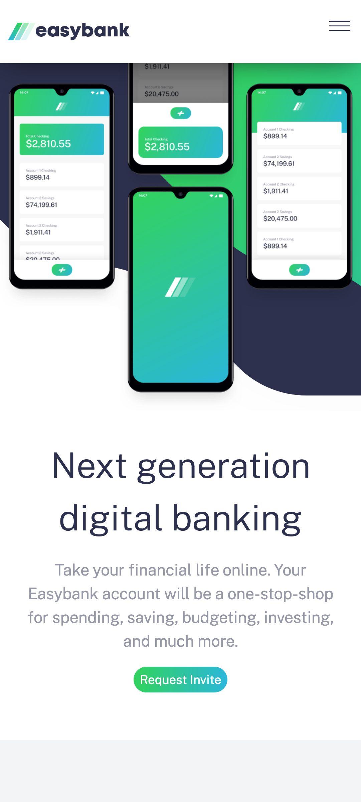

# Frontend Mentor - Easybank landing page

A personal solution to [Easybank landing page challenge on Frontend Mentor](https://www.frontendmentor.io/challenges/easybank-landing-page-WaUhkoDN). Frontend Mentor challenges help you improve your coding skills by building realistic projects.

## Table of contents

- [Overview](#overview)
  - [The challenge](#the-challenge)
  - [Screenshot](#screenshot)
  - [Links](#links)
- [My process](#my-process)
  - [Built with](#built-with)
- [Author](#author)
- [Acknowledgments](#acknowledgments)

## Overview

This is a fictional digital bank homepage, features a hero section with a call to action, bold images showcasing the app and latest articles.

### The challenge

Users should be able to:

- View the optimal layout for the site depending on their device's screen size
- See hover states for all interactive elements on the page

### Screenshot




### Links

- Solution URL: [FM Solution](https://www.frontendmentor.io/challenges/room-homepage-BtdBY_ENq/hub/flat-design-cosy-room-homepage-with-960-grid-system-Wn4I5dILO)
- Live Site URL: [Cosy Room Homepage: (github pages)](https://abu-hasib.github.io/easy-banking/)
- Live Site URL: [Cosy Room Homepage: (vercel)](https://easy-banking-rho.vercel.app/)

## My process

I went with the vanilla way. Even though it took longer but it was worth it. I got to play around with different way doing things.

I followed these steps but still overlapped as time went by.

    Fleshed out the html
    Wrote the styles
    Added interactivity

### Built with

- Semantic HTML5 markup
- CSS custom properties
- CSS Animations
- Intersection Observers

### What I learned

using scoped css custom properties

```css
.a-particular-class {
	/* scoped custom properties */
	--color: var(--default-color);
	color: var(--color);
}

.an-added-class-to-a-particular-class {
	--color: var(--another-color);

	display: block;
}
```

harnessing the power of Intersection Observers for animating when a certain content is in view of the current device

```js
const appearOnScroll = new IntersectionObserver(function (entries, appearOnScroll) {
	entries.forEach((entry) => {
		if (!entry.isIntersecting) return;
		else {
			entry.target.classList.add('appear');
			appearOnScroll.unobserve(entry.target);
		}
	});
}, appearOptions);
```

## Author

- Website - [Ridwan](https://ridwanabiola.netlify.app/)
- Frontend Mentor - [@abu-hasib](https://www.frontendmentor.io/profile/abu-hasib)

## Acknowledgments

- Kevin Powell - Checkout [Kevin Powell's youtube](https://www.youtube.com/kepowob)
  **Have fun building!** 🚀🚀
